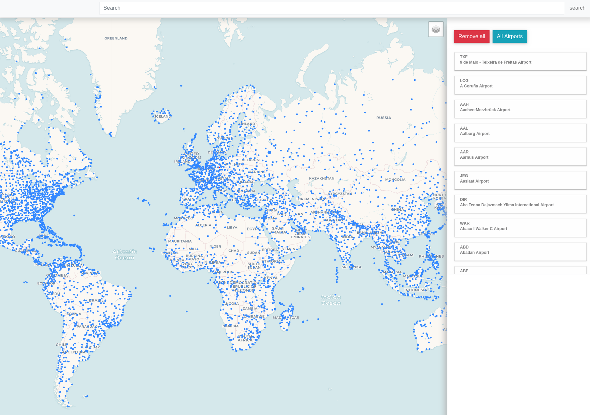
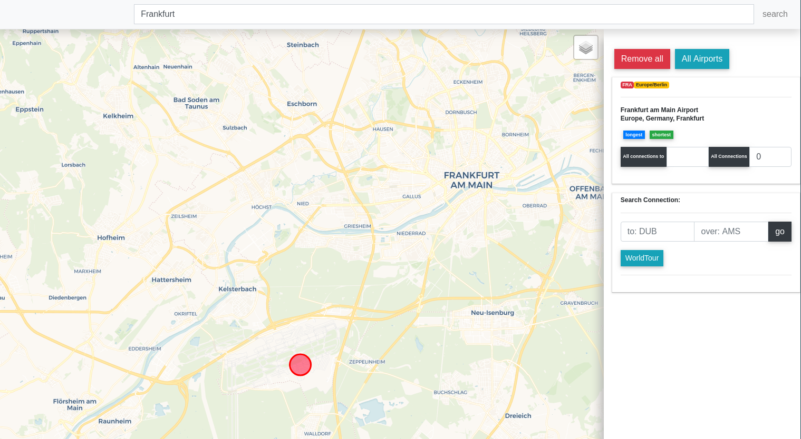
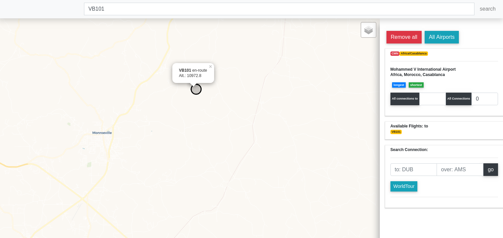
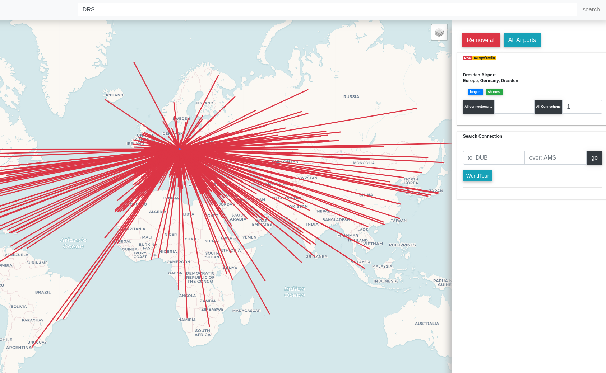
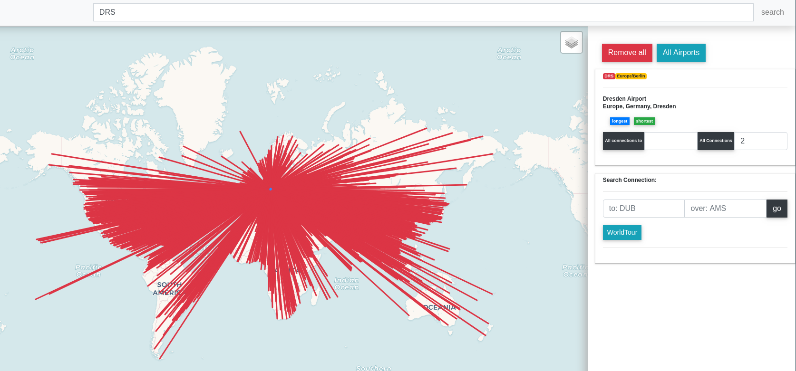
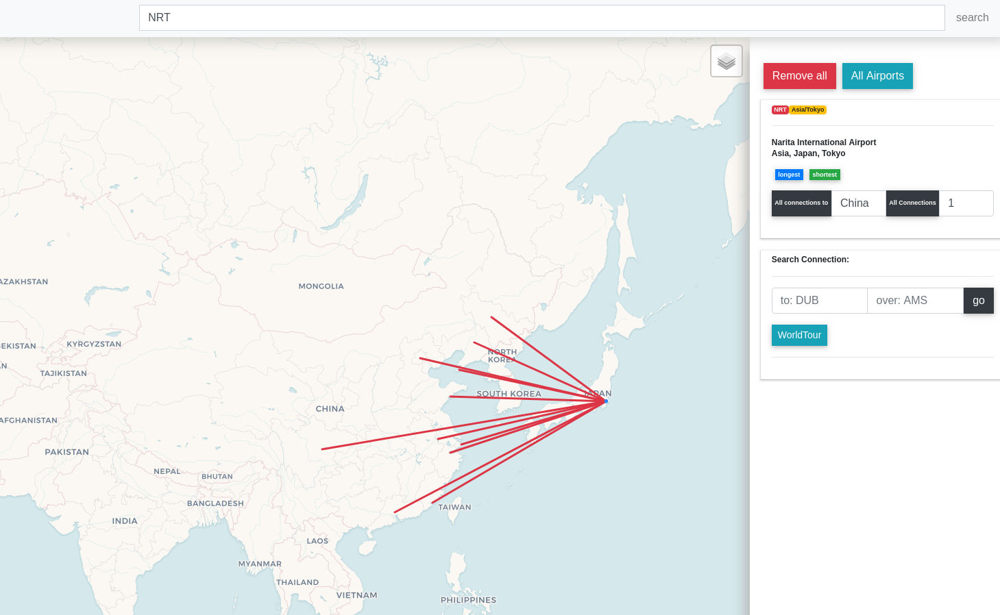
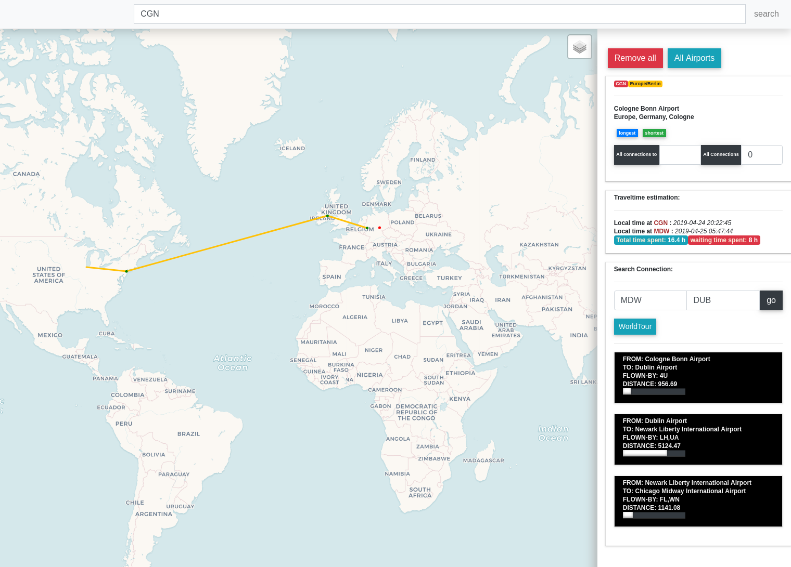
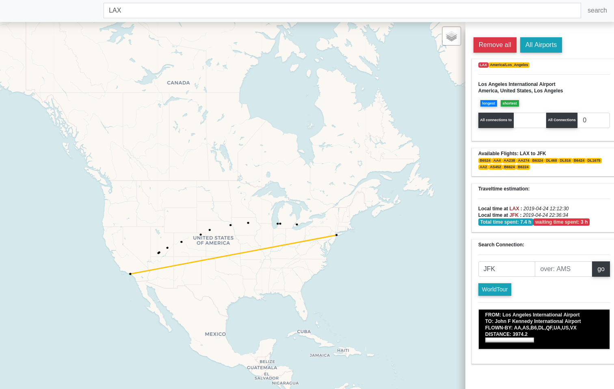
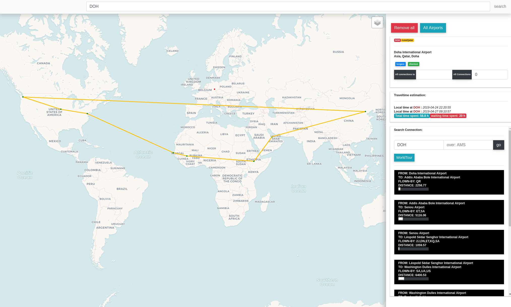

# FlyPy

## Installation

### Prerequisite

- docker
- docker-compose
- python3
- git (optional)
- internet connection (to install the dependencies)
- maybe admin rights  (to deploy the containers)

####

1. Pull the repository from github
2. Change the directory to the projects root (*the one with docker-compose.yml, migrate.py ...*)
3. Start all containers with `docker-compose up` , if this is done initally this may take a while  
    3.1 if you want to rebuild a single container do so with: `docker-compose build --no-cache flask_app` or `docker-compose build --no-cache nginx_app`  
4. If step 3 was successfull you can check it be typing `http://localhost:5000/airport/CGN` or `http://localhost:4200`, `http://localhost:9200/_cat/indices?v` into your browser, if you get an response the application  is running and deployed but there is no data, it can work with.
5. Migrating data to the application. Make sure you are still in the projects root, by executing `python3 migrate.py` the elastic search index ist filled with data. It fills it with 6000 Airports and ~70000 flight-routes so the may take a while, but you only have to do this once.
6. If the elastic search index is filled you can use the application by visiting localhost:4200 in your browser

*note the ports 5000 4200 9200 and 9300 are used by this application, so make sure that these are not allready in use*

## Features

----
#### Display all Airports

<i>press all Airports button</i>

<i> All Airports</i>

---
#### Search

- Search a **Airport** <i>by typing in searchbar</i>
    - by IATA Code i.e. FRA (Frankfurt), SFO (San Francisco), PEK (Peking)
    - by City name
    - by Country name

If a Airport is found, the Airport Information is displayed in the top Container on the right sidebar and Airport specific features can be accessed.

<i> Search for Airport by City name (Frankfurt)</i>

- search a **Flight** <i>by typing in searchbar</i>
    - by FlightNr-Iata i.e. <i>LH454</i>
    - if the Flight is active and found, hover over FlightNr in the right side container (Available Flights) and the map view is recenterd to the given flight

<i> Search Flight by IATA-FlightNr.</i>

---
#### Show all connections

- show all possible connections form the selected airport, by clicking on the *all connections* button in the Airport details container. Furthermore you can specify the transit steps (between 0- 2), i.e. show all connections from Frankfurt with 1 transit. 
*note that the calculations of all connections with 2 transits may take a while*

All connections from Dresden-Airport with different transit counts.

| 0 transist| 1 transit  | 2 transit
|----------|-------------|----|
|| ||

- show all possible connections *to* a specific destination
    - by using the *all connections to* button

<i> All connections from Tokyo to China</i>

---
#### Find a Route

After you found an Airport like described in the step above you can find a route to another Airport, by entering the destination airport IATA in the *Search Connection* container in the right sidebar. You also can add Steps to the routing, (example in the picture below: *from CGN to MDW over DUB*). 

If the route was found it is displayed in the mapview, the traveltime is estimated as well as the local time at arrival. Further more the flightplan with all travel steps is displayed in the black-boxes on the right. 

<i> Find a Route from Cologne over Dublin to Chicago</i>

---
#### Track active Flights

You either could search a Flight directly via the searchbar (see search section), or find a route between two Airports and click on the black box of the flightplan (right sidebar), the application then searchs for active Flights on that route (see example below). 

All Active flights are listed in the *available flights* container on the right side.
  

<i> All active Fligths between LAX and JFK</i>

---
#### Worldtour

If a airport is selected, a worldtour could be calculated by clicking on the *worldtour* button in the *search-connection* container in the sidebar. *Depending on the health status of the elastic search index cluster the calculation time could vary*

<i> Worldtourn which starts in Doha</i>

___
## made with 

**Stack:**
- elastic search
    - is used as no-sql data storage and to provide fast responses for search queries
- flask
    - used to create a restful backend in python
- angular
    - is used to create an frontend to the backend functionalities

**Data:**
- openflight data - thanks to providing free data on routes an airports: https://openflights.org/data.html
- aviation-edge - is used to track active fligths
