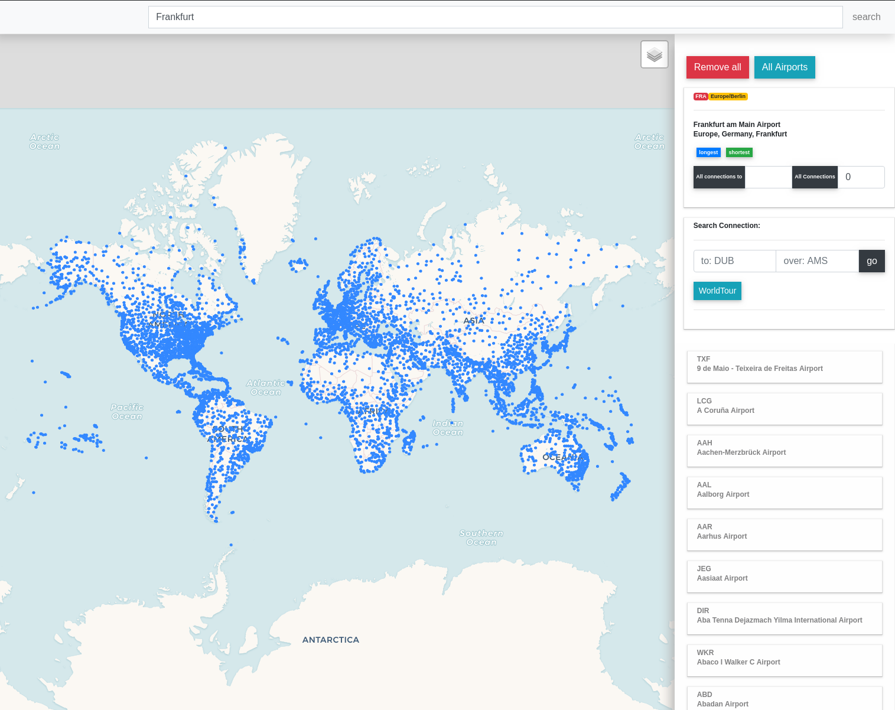

# FlyPy

### Installation

### Features

----

#### Display all Airports

<i>press all Airports button</i>

<i> Search for Frankfurt Airport by City name</i>

#### Search

- Search a **Airport** <i>by typing in searchbar</i>
    - by IATA Code i.e. FRA (Frankfurt), SFO (San Francisco), PEK (Peking)
    - by City name
    - by Country name

If a Airport is found, the Airport Information is displayed in the top Container on the right sidebar and Airport specific features can be accessed.

<i> Search for Frankfurt Airport by City name</i>

- search a **Flight** <i>by typing in searchbar</i>
    - by FlightNr-Iata i.e. <i>LH454</i>
    - if the Flight is active and found, hover over FlightNr in the right side container (Available Flights) and the map view is recenterd to the given flight

<i> Search Flight by IATA-FlightNr.</i>

---
#### Find a Route

<i> Search Flight by IATA-FlightNr.</i>
